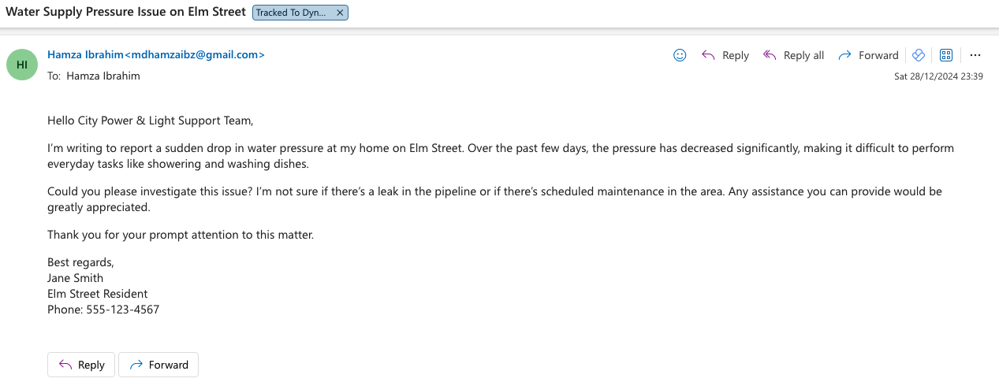
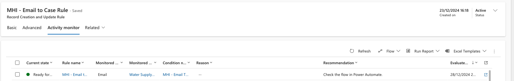
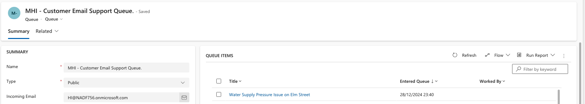
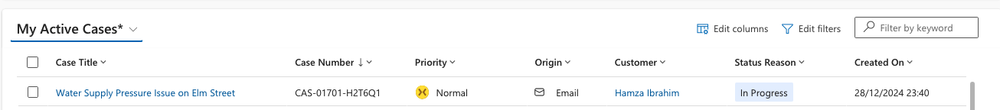
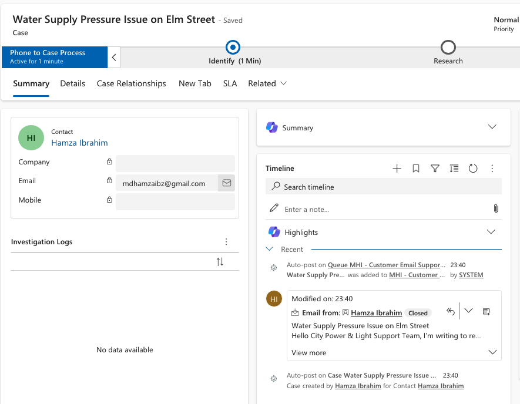
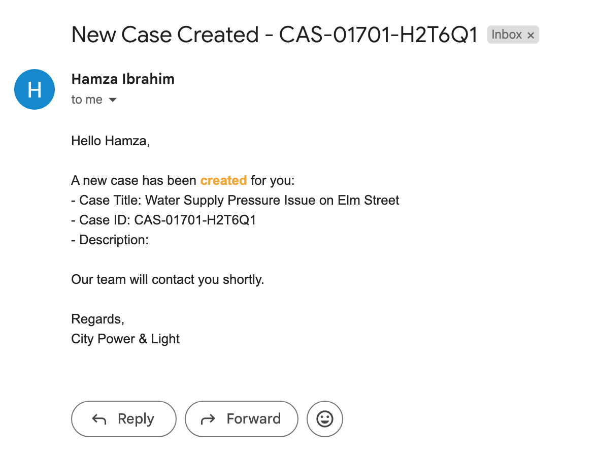
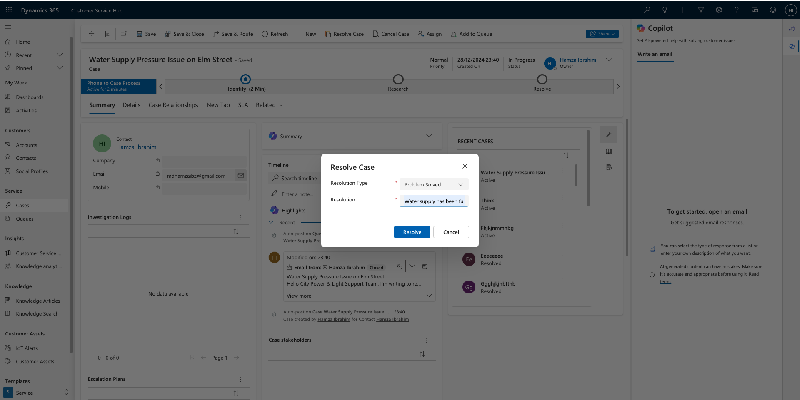
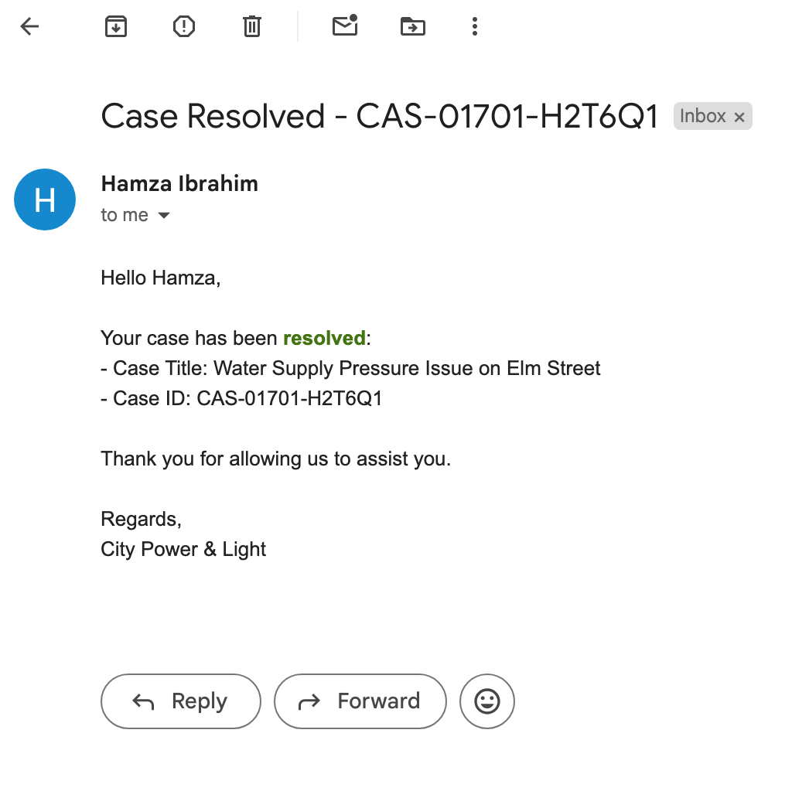
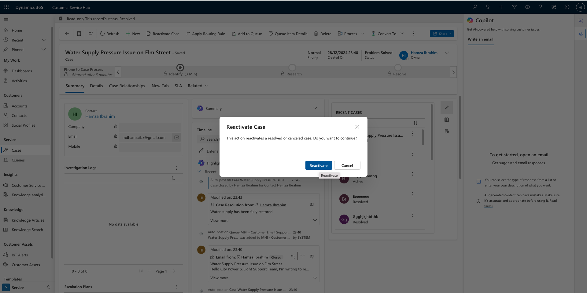
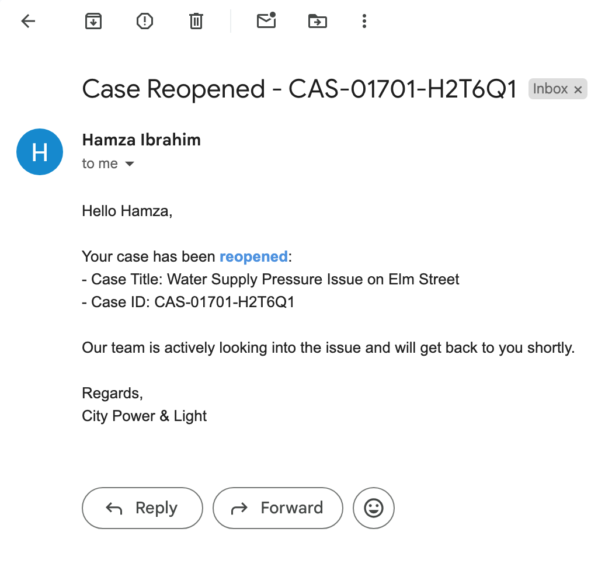

# Scenario 5 and 4 Example

---

## Step 1: Configuring Record Creation Rules
**Objective**: Automatically create a case from an incoming email in a queue.

### Example:
1. **Incoming Email**  
     
   An email is sent by a customer reporting an issue with water supply pressure.

2. **Activity Monitor**  
     
   The **Email to Case Rule** is triggered and monitored in Dynamics 365.

3. **Queue Items**  
     
   The email is added to the **MHI - Customer Email Support Queue** for processing.

4. **Case Creation**  
     
     
   A case is automatically created from the email with the title **Water Supply Pressure Issue on Elm Street** and added to the **My Active Cases** list.

5. **Email Notification**  
     
   The Power Automate flow is triggered upon case creation, checking if the customer is linked to an account or contact and sending the appropriate notification.  
   The customer receives a notification confirming that a new case has been created.

---

## Step 2: Sending Email Notifications for Case Resolution
**Objective**: Notify the customer when a case is resolved.

### Example:
1. **Case Resolved**  
     
   The case is resolved in Dynamics 365.

2. **Email Notification**  
     
   The customer receives an email confirming that the issue has been resolved.

---

## Step 3: Sending Email Notifications for Case Reopening
**Objective**: Notify the customer when a case is reopened.

### Example:
1. **Reactivate Case**  
     
   The case is reactivated in Dynamics 365.

2. **Email Notification**  
     
   The customer is notified that the case has been reopened and is under review.

---

## Summary
- **Scenario 4**: Successfully implemented record creation rules and routing rules to automate case management and ensure streamlined operations.
- **Scenario 5**: Configured Power Automate flows to notify customers at key stages of case management, enhancing communication and customer satisfaction.

---

