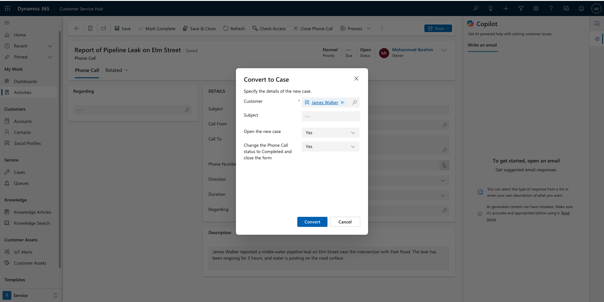

# Scenario 1: Testing New Case Functionality at City Power & Light
You are a customer service manager at City Power & Light who has been tasked with trying the new case functionality before rolling it out to your users. In this task, you will create new customer cases and create phone calls associated with the cases.

## Overview
This document summarizes the testing of the new case functionality, including custom table creation, many-to-one relationships, account and contact management, case creation, and activity-to-case conversion. Below is an explanation of each image provided and its relevance to the testing process.

---

### Image 1: Custom Tables Overview

- Two custom tables, **MaintenanceSchedule** and **OutageRequest**, were created to enhance case management.
- These tables were designed to establish **many-to-one relationships** with the **Cases** table. This structure allows multiple maintenance or outage records to link to a single case, ensuring detailed tracking.

---

### Image 2: Case Form with Custom Table Sub-Grids

- The **Case Form** was modified to include sub-grids for the **MaintenanceSchedule** and **OutageRequest** tables.
- These sub-grids provide an interface for case handlers to view and manage related maintenance and outage activities directly within the case form, making the process seamless and efficient.

---

### Image 3: Many-to-One Relationships

- **Many-to-One Relationships** were created between the custom tables and the **Cases** table.
- These relationships ensure that each case can track multiple related records, such as multiple outages or scheduled maintenance tasks.

---

### Image 4: Account Creation

- An account named **Greenfield Residential Community** was created to represent a customer organization.
- The account includes essential information, such as the phone number, that links it to related contacts and cases.

---

### Image 5: Contact Creation

- A contact named **Sarah Johnson** was created and associated with the **Greenfield Residential Community** account.
- This ensures accurate tracking of individual interactions within the context of their organization.

---

### Image 6: Case Creation Linked to Contact

- A case titled **Water Supply Disruption in Greenfield Community** was created and linked to the contact **Sarah Johnson**.
- The case tracks the resolution process for a reported issue and includes relevant case details, such as the title, description, and customer information.

---

### Image 7: Phone Call Activity in Case Timeline

- A phone call activity was added to the case timeline.
- The activity logs a follow-up discussion with **Sarah Johnson** regarding the disruption in water supply and updates the progress of the case resolution.

---

### Image 8: Phone Call Activity to Case Conversion

- A phone call titled **Report of Pipeline Leak on Elm Street** was created and linked to **James Walker**.
- The activity includes details about the reported issue and was later converted into a case using the **To Case** functionality.

---

### Image 9: Case Created from Phone Call

- The phone call activity was successfully converted into a case titled **Report of Pipeline Leak on Elm Street**.
- The case is now linked to **James Walker**, and all relevant details from the activity were carried over into the case.

---

### Final Summary
This task was successfully achieved, as all aspects of the new case functionality were tested thoroughly. The following goals were accomplished:
- **Custom table creation**: Tables like **MaintenanceSchedule** and **OutageRequest** were linked to cases, streamlining data management.
- **Many-to-one relationships**: These relationships enabled scalable tracking of multiple related records within a single case.
- **Account and contact management**: Accurate records for accounts and contacts, such as **Greenfield Residential Community** and **Sarah Johnson**, were created and linked.
- **Case creation**: New cases, such as **Water Supply Disruption in Greenfield Community**, were created and associated with customers.
- **Phone call activity and case linking**: Activities, such as follow-ups, were successfully logged and converted into cases where necessary.

The testing validated the new case functionality and ensured its readiness for rollout, effectively enabling customer service teams to manage cases and related activities more efficiently.
