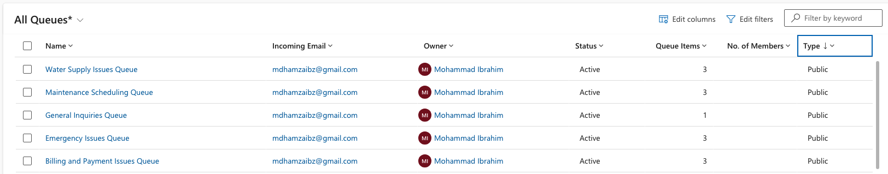

# Scenario 2: Creating Queues for Case Management at City Power & Light
You are a customer service manager at City Power & Light. You need to create queues for the customer service representatives to use for processing cases. In this task, you will create multiple queues and add cases and activities to queues.

## Overview
This document details the steps taken to create and manage queues for case processing. The provided images illustrate the queues and their associated items to ensure seamless case management.

---

### Image 1: Created Queues

- Multiple queues were created to categorize and manage customer cases and activities effectively.
- The following queues were established:
  - **Water Supply Issues Queue**
  - **Maintenance Scheduling Queue**
  - **General Inquiries Queue**
  - **Emergency Issues Queue**
  - **Billing and Payment Issues Queue**
- Each queue was assigned an owner (**Mohammad Ibrahim**) and configured to receive incoming cases or activities through the provided email.
- The queues were set to **Public**, allowing all customer service representatives to access and process items.

---

### Image 2: Items in Queues

- The **All Items** view displays cases and activities distributed across the created queues.
- Examples of items in the queues include:
  - **Emergency Issues Queue:**
    - Emergency Water Leak in South London (Case, Phone Call, Email)
  - **Maintenance Scheduling Queue:**
    - Schedule Inspection for East London Pipeline (Task)
    - Scheduled Maintenance for East London Pipeline (Case, Phone Call)
  - **Billing and Payment Issues Queue:**
    - Incorrect Meter Reading for Tower Hamlets (Case, Phone Call)
    - Billing Issue for Account #12345 (Case)
  - **Water Supply Issues Queue:**
    - Water Supply Issue in Central London (Case, Phone Call)
    - Update on Water Supply Issue in Central London (Email)
  - **General Inquiries Queue:**
    - Follow-up on Water Supply Disruption (Phone Call)

---

### Key Highlights
1. **Queue Creation:**
   - Queues were tailored to specific case categories, ensuring streamlined processing by customer service representatives.
   - Items within each queue were categorized by type (e.g., Case, Phone Call, Email, Task).

2. **Item Distribution:**
   - Cases and activities were assigned to queues based on their nature and urgency.
   - This structure helps prioritize issues and allocate them to the appropriate representatives efficiently.

---

### Final Summary
By creating dedicated queues and associating cases and activities with them, City Power & Light ensures:
- Efficient case categorization and management.
- Better workload distribution among customer service representatives.
- Enhanced focus on resolving issues based on their type and priority.

The provided images demonstrate the successful setup and utilization of queues, fulfilling the objective of improving case and activity management for customer service operations.
