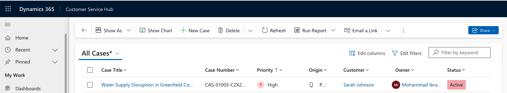
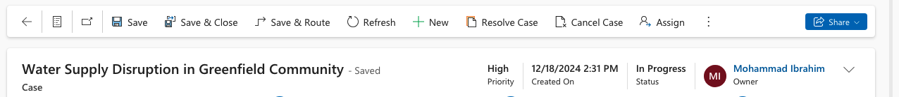
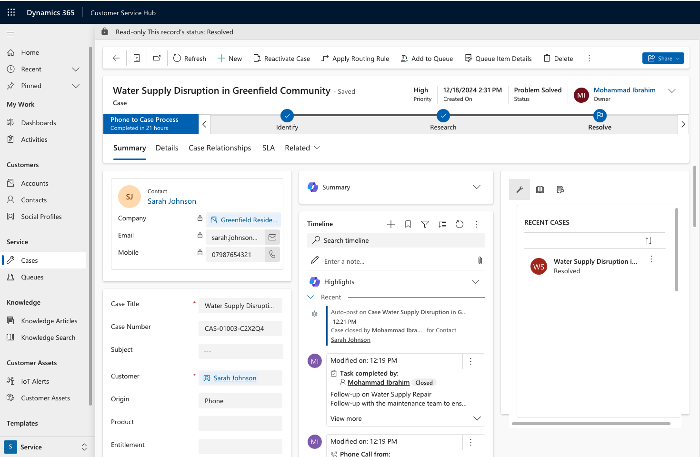
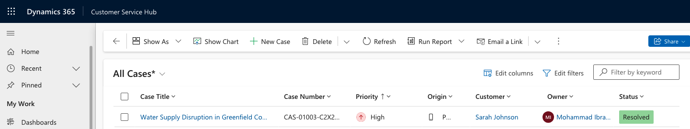
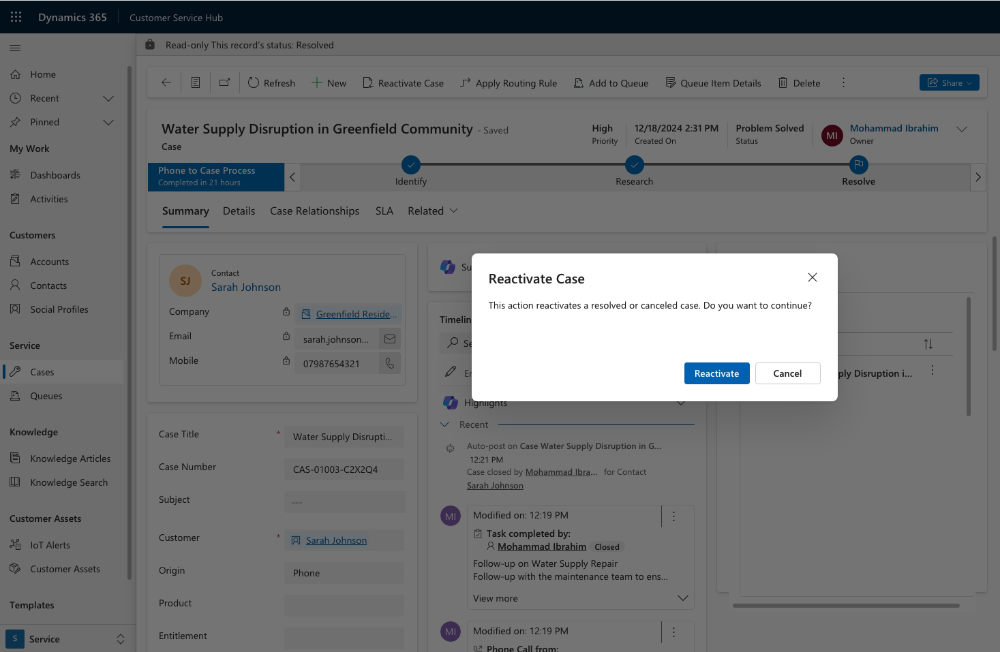

# Scenario 3: Testing Case Resolution and Reactivation at City Power & Light
You are a customer service manager at City Power & Light who has been tasked with trying the new case resolution and reactivation functionality before rolling it out to your users. In this task, you will resolve a case and reactivate it.

## Overview
This document summarizes the process of resolving a case and reactivating it to ensure that the new functionalities are working as expected. Below is an explanation of each image provided and its relevance to the testing process.

---

### Image 1: Viewing Active Cases

- The **All Cases** view shows the case titled **Water Supply Disruption in Greenfield Community** in an active state.
- This view highlights the case details, including the owner, priority, and current status as "Active."

---

### Image 2: Case Details - Preparing to Resolve

- The case details screen displays the information for **Water Supply Disruption in Greenfield Community**.
- The case is currently in the **In Progress** stage, with high priority and ongoing actions logged in the timeline.

---

### Image 3: Resolved Case View

- The case has been marked as **Problem Solved** and its status updated to "Resolved."
- The timeline includes updates about the resolution process, including follow-up actions and closure details.

---

### Image 4: Reactivate Case Option

- The **Reactivate Case** option is available for the resolved case, allowing further actions to be taken if needed.
- This functionality is essential for reopening cases when additional work is required.

---

### Image 5: Reactivating the Case

- The **Reactivate Case** dialog confirms the action to reopen the resolved case.
- This ensures that users explicitly acknowledge the reactivation of a case to avoid accidental changes.

---

### Image 6: Case Reactivated

- After reactivation, the case returns to the **Active** status.
- The updated case is now ready for further actions or resolution steps.

---

## Final Summary
The testing successfully demonstrated the following:
1. **Resolving a Case**: The functionality to mark a case as resolved worked seamlessly, updating the case status and logging all actions in the timeline.
2. **Reactivating a Resolved Case**: The reactivation feature allowed reopening the case for further actions, ensuring flexibility in case management.

The scenario confirms that the new resolution and reactivation features are ready for deployment to users at City Power & Light, enabling efficient handling of customer service cases.
