# Scenario 4: Testing New Case Routing Functionality at City Power & Light

You are a customer service manager at City Power & Light who has been tasked with trying the new case routing functionality before rolling it out to your users. In this task, you will create record creation rules, and case routing rules and test how they work.
Configure record creation rules -  Enable a case to be created from an email in a queue Basic routing - Configure basic routing rule set and route cases.

---

## Overview

This document outlines the process of configuring record creation rules and basic routing rules to manage incoming customer service requests effectively. Key tasks included:
- Enabling case creation from incoming emails.
- Configuring a basic routing rule set to route cases automatically to the appropriate queues.

---

## Record Creation Rule Configuration

### Image 1: Queue Configuration for Email Case Management
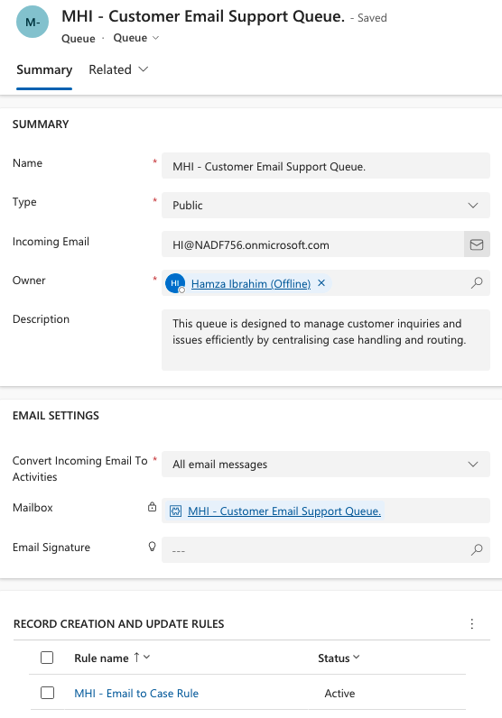
- A queue named **MHI - Customer Email Support Queue** was created to manage incoming emails and convert them into cases.
- The queue is set to public, and the incoming email is configured to forward all customer inquiries to the queue.

---

### Image 2: Email to Case Rule
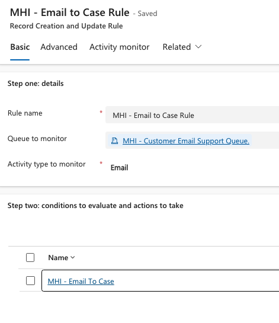
- A record creation rule, **MHI - Email to Case Rule**, was configured to monitor the queue for incoming email activities.
- This rule evaluates incoming emails and automatically creates cases for relevant inquiries.

---

### Image 3: Workflow for Email to Case Conversion
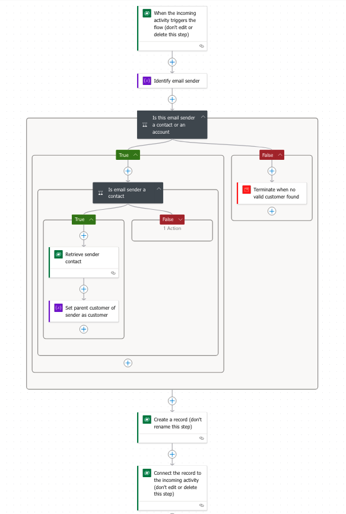
- The workflow identifies the email sender and checks whether the sender is a known contact or account.
- If the sender is identified, the email is connected to the respective customer, and a case is created automatically.
- If the sender is not identified, the workflow terminates to ensure invalid customers are excluded.

---

## Case Routing Rule Configuration

### Image 4: Basic Routing Rule Set
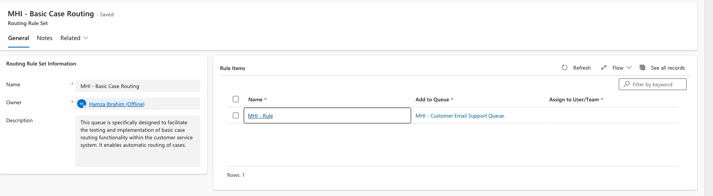
- A basic routing rule set, **MHI - Basic Case Routing**, was created to automate case routing.
- This rule set routes cases based on predefined criteria to the appropriate queue.

---

### Image 5: Routing Rule Example
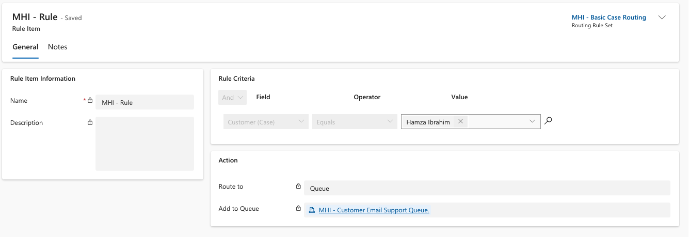
- A specific routing rule, **MHI - Rule**, directs cases where the customer is **Hamza Ibrahim** to the **MHI - Customer Email Support Queue**.
- The rule ensures that cases are systematically routed to the correct queue based on customer details.

---

## Testing the Functionality

### Example: Case Creation from Email

#### Image 6: Incoming Email Example
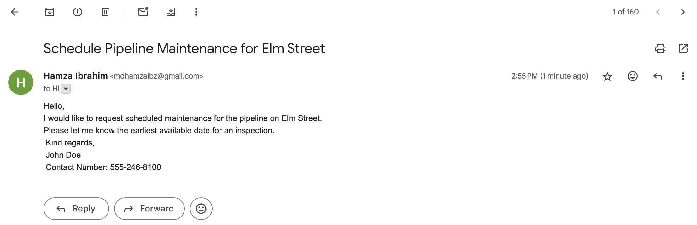
- A sample email was sent by **John Doe**, requesting pipeline maintenance on Elm Street.
- The email was forwarded to the **MHI - Customer Email Support Queue** for processing.

---

#### Image 7: Email Monitored by the Rule
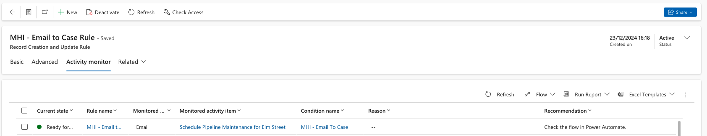
- The email was successfully monitored by the **MHI - Email to Case Rule**.
- The rule evaluated the incoming email and identified it as ready for conversion into a case.

---

#### Image 8: Email Added to the Queue
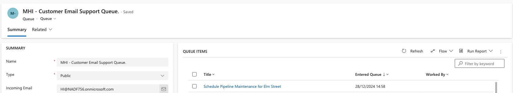
- The email was added as a queue item in the **MHI - Customer Email Support Queue**.
- This ensures visibility and tracking for all incoming inquiries.

---

#### Image 9: Case Creation Example
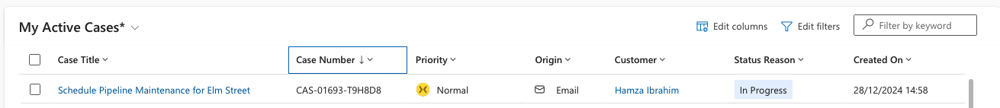
- A case titled **Schedule Pipeline Maintenance for Elm Street** was created automatically from the incoming email.
- The case includes the email details, ensuring accurate information transfer for resolution.

---

#### Image 10: Case Summary and Timeline
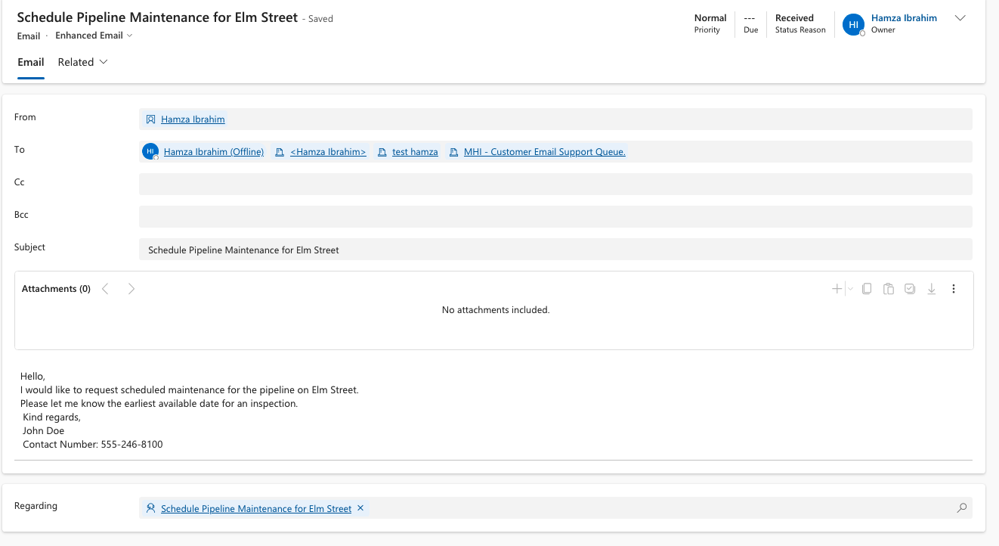
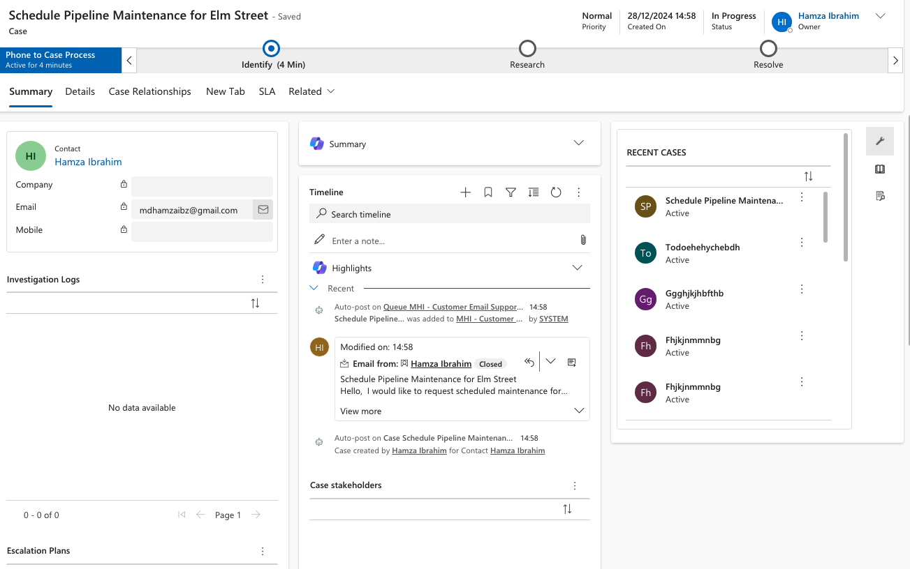
- The case details, including the title, origin, customer, and timeline, were updated in the system.
- The timeline logs the email as the initiating activity for the case, ensuring complete traceability.

---

## Final Summary

The examples above demonstrate the successful implementation and testing of the new case routing functionality. The system now allows:
1. **Automatic case creation from emails**, streamlining the process for customer inquiries.
2. **Efficient routing of cases** based on predefined rules, ensuring cases are directed to the appropriate queues for resolution.

This configuration enhances customer service efficiency, reduces manual intervention, and ensures a systematic approach to case handling.
