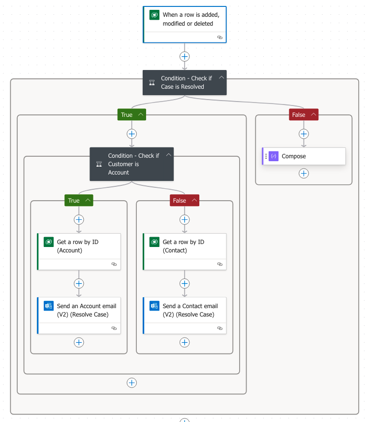

# Scenario 5: Automating Email Notifications for Case Events

As a customer service manager at City Power & Light, you have been tasked with testing the email notification functionality using Power Automate cloud flows. This ensures that related accounts and contacts are notified when cases are created, resolved, or reopened.

## Overview
This document explains the configuration and functionality of Power Automate cloud flows designed to send email notifications for case events. These include notifications for case creation, resolution, and reopening.

---

### Image 1: Case Created Email Notification Flow

- **Trigger**: The flow is triggered when a row (case) is added, modified, or deleted.
- **Condition**: Checks if the customer is an account or a contact.
  - **True**: Retrieves the account details and sends an email to the account.
  - **False**: Retrieves the contact details and sends an email to the contact.
- **Outcome**: Sends a notification email to the appropriate recipient whenever a case is created.

---

### Image 2: Case Resolved Email Notification Flow

- **Trigger**: The flow activates when a row (case) is updated.
- **Condition 1**: Verifies if the case status is "Resolved".
  - If true, proceeds to the next step.
- **Condition 2**: Checks if the customer is an account or a contact.
  - **True**: Sends an email to the account notifying them of the resolution.
  - **False**: Sends an email to the contact notifying them of the resolution.
- **Outcome**: Notifies the related account or contact when a case is marked as resolved.

---

### Image 3: Case Reopened Email Notification Flow

- **Trigger**: The flow activates when a row (case) is updated.
- **Condition 1**: Verifies if the case status is "Reopened".
  - If true, proceeds to the next step.
- **Condition 2**: Checks if the customer is an account or a contact.
  - **True**: Sends an email to the account notifying them that the case has been reopened.
  - **False**: Sends an email to the contact notifying them that the case has been reopened.
- **Outcome**: Ensures that accounts or contacts are informed about reopened cases for follow-up action.

---

### Example Email Notifications for Case Events

#### Case Created Notification

- The notification includes details such as:
  - **Case Title**: Water Supply Pressure Issue on Elm Street.
  - **Case ID**: CAS-01701-H2T6Q1.
  - **Description**: Details the issue reported by the customer.
- Purpose: Informs the customer that their issue has been logged and is being reviewed.

---

#### Case Resolved Notification

- The notification includes details such as:
  - **Case Title**: Water Supply Pressure Issue on Elm Street.
  - **Case ID**: CAS-01701-H2T6Q1.
  - **Resolution**: Details the resolution provided for the case.
- Purpose: Confirms that the customer's issue has been successfully resolved.

---

#### Case Reopened Notification

- The notification includes details such as:
  - **Case Title**: Water Supply Pressure Issue on Elm Street.
  - **Case ID**: CAS-01701-H2T6Q1.
  - **Update**: Notifies the customer that the case has been reopened for further investigation.
- Purpose: Keeps the customer informed about the status of their case.

---

## Summary
The Power Automate flows successfully automate email notifications for case events. This functionality improves communication with customers by providing timely updates on case statuses:
- Notifications are sent upon **case creation** to inform the customer of the logged issue.
- **Case resolution notifications** assure customers that their issues have been addressed.
- **Case reopening notifications** alert customers about the continued investigation or follow-up.

These workflows enhance transparency and customer service efficiency, supporting the rollout of the email functionality to end users.
